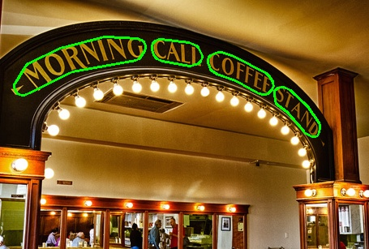
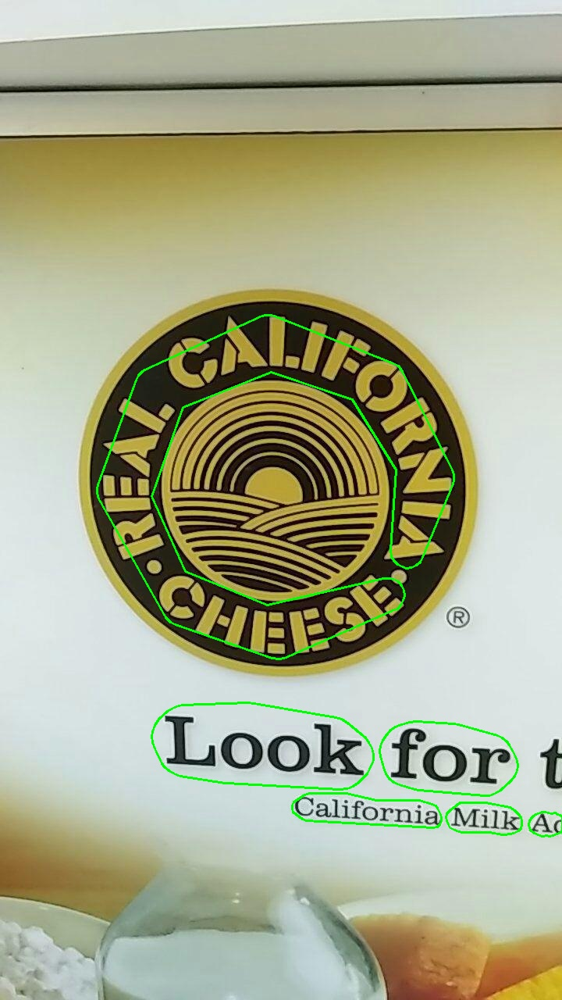

# DifferentiableBinarization
This is an implementation of [Real-time Scene Text Detection with Differentiable Binarization](https://arxiv.org/abs/1911.08947) in Keras and Tensorflow,
Most portions of code are borrow from the official implementation [MhLiao/DB](https://github.com/MhLiao/DB).

## Build Dataset
Building dataset in the same way as the official implementation.
```
  datasets/total_text/train_images
  datasets/total_text/train_gts
  datasets/total_text/train_list.txt
  datasets/total_text/test_images
  datasets/total_text/test_gts
  datasets/total_text/test_list.txt
```

## Train
`python train.py`
Here is a trained model on TotalText [baidu netdisk](https://pan.baidu.com/s/1SGKgI6pMuGvUb8RlHePQxA) code:jy6m

## Test
`python inference.py`

 


